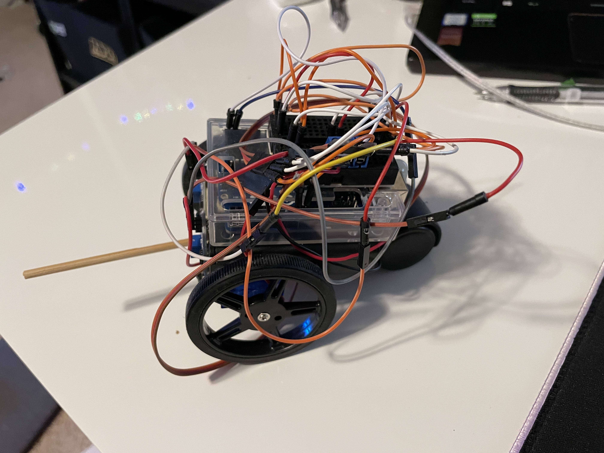
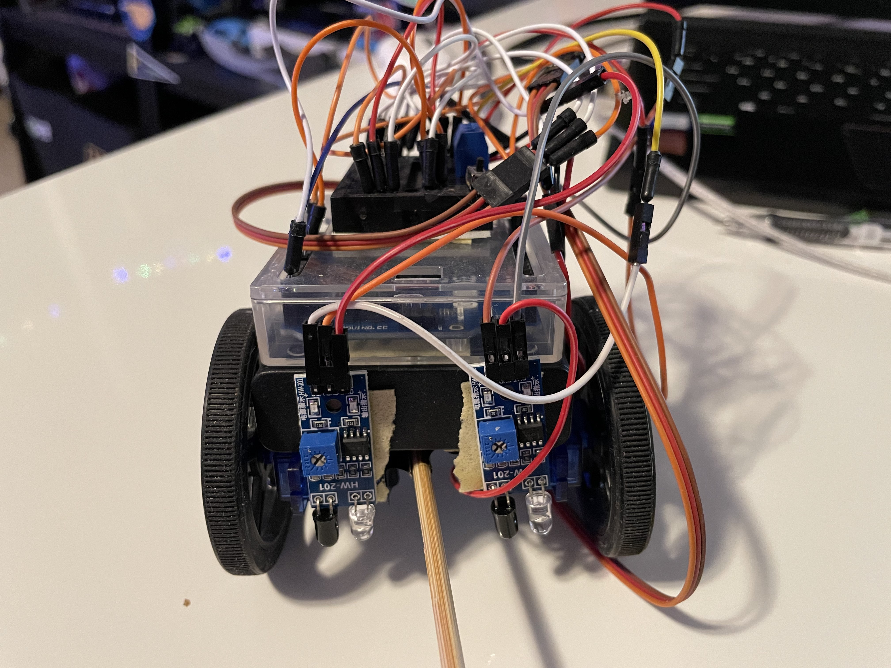

# Line Following Robot

A line following robot, using 2 continous rotation servos and 2 IR sensors connected to an Arduino Uno. The robot goes along a line, and turns left or right depending on whether the left or right IR sensor is triggered, in order to stay on that line. The robot is powered by four AA batteries and has a small office chair wheel as its rear wheel. 

The robot's structure is fairly simple, with the Arduino attached the top of the battery pack, and the 2 servos attached to the front right and left corners. The IR sensors are mounted about 1.5 inches above the surface, in front of the 2 servos. You can tune the sensitivty in the program. A breadboard for the wiring is mounted on top of the Arduino, and the office chair wheel is attacked to the rear center.

## BOM
- 2x Mini Continuous Rotation Servo (reccomend ones that come with wheels)
- 2x IR Obstacle Sensor Module
- 1x Four AA Battery Holder
- 1x Arduino Uno
- 1x Mini Office Chair Wheel
- 1x Breadboard
- A bunch of wires

## Connections
- Right servo to pin 9
- Left servo to pin 10
- Left sensor to pin A4
- Right sensor to pin A5
- Connect all VCC and GND to the battery pack